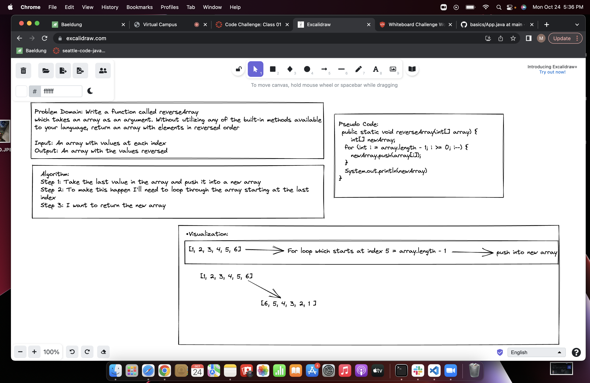

# Reverse an Array

- Write a function called reverseArray which takes an array as an argument. Without utilizing any of the built-in methods available to your language, return an array with elements in reversed order

## Whiteboard Process

## Approach & Efficiency

- I did not take efficiency into consideration but if I did, I would have looked into the two pointer technique. For both time and efficiency I have a value of O(n)
