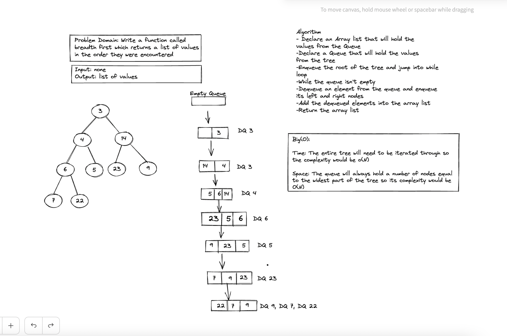

# Breadth First Search

- To get the value from each node of the tree we need to touch each node. The time complexity will be O(N) for this reason.
For the space complexity a breadth-first approach with a queue yeilds a O(N). The width of the widest point on the tree is the 
most elements that will be in the queue at any point in time during iteration.

-Code can be found in binaryTree class
