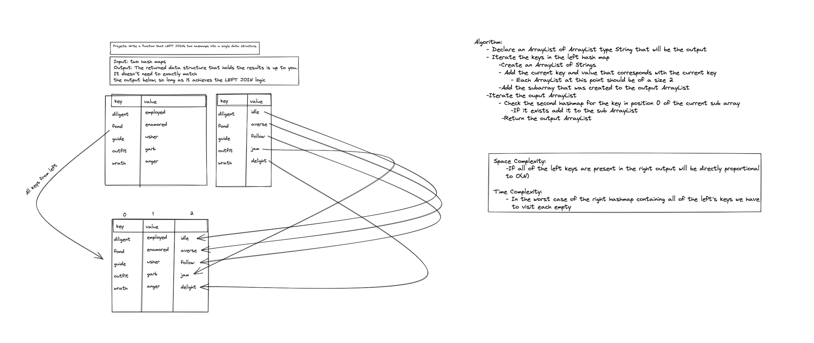

# Left Join Code Challenge

- Approach: I used multiple linked lists to make it easier to add new value and to help keep track of size. I used indexed 0 and 1 for the left's key and value, while using index 2 match the values

- Efficiency can be seen in the whiteboard
