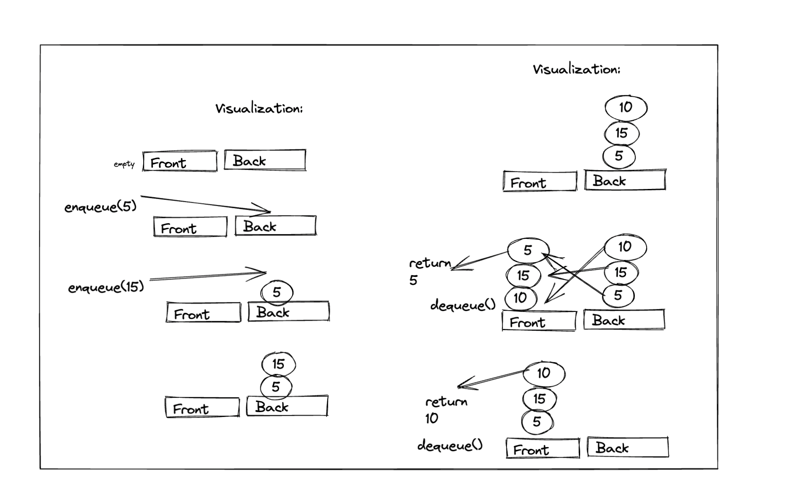

# PseudoQueue

- To represent the Queue with two stacks I designated one stack as the front, the top value in this "front" stack will always be the front of the queue. The back stack is where new elements get pushed as they enter the queue. To dequeue if the front stack is empty, we need to push each value from the back stack onto the front stack (reversing them), then pop the top of the front.

- Enqueue elements can be directly pushed onto the back stack and since the underlying stack has a time complexity of O(1) for pushing, this Pseudo queue has a O(1) time complexity for enqueue.

- To dequeue the best case is O(1) but the worst case we need to pop each value from the back and push to the front creating O(N) time complexity.

- Both methods do not use any other data structures and do not use more disk space as N increases: O(1).
