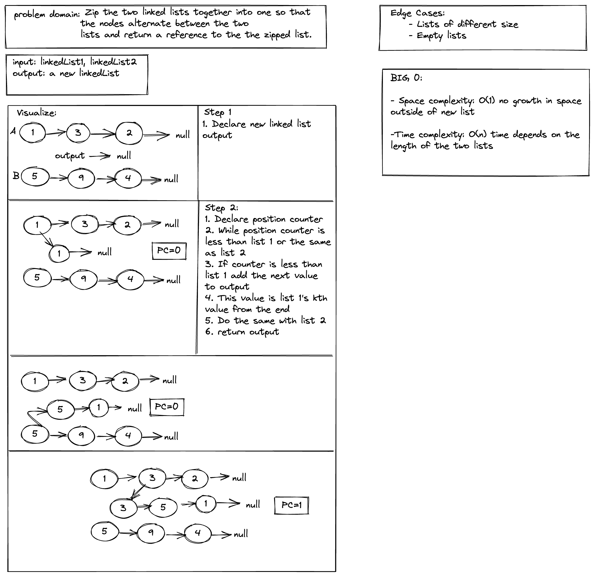
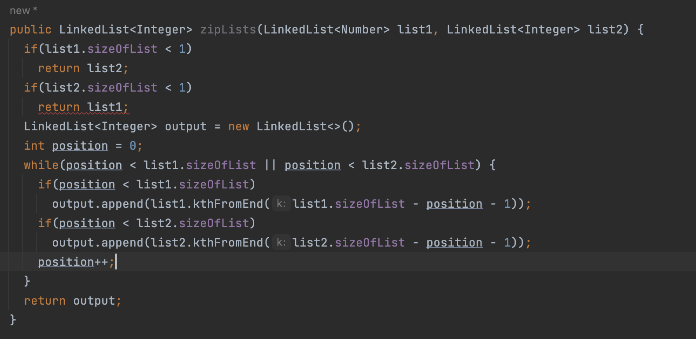

# Challenge 08 

## Problem Domain

- Write a function called zip lists

- Arguments: 2 linked lists
 
- Return: New Linked List, zipped as noted below

- Zip the two linked lists together into one so that the nodes alternate between the two lists and return a reference to the the zipped list.

- Try and keep additional space down to O(1)

- You have access to the Node class and all the properties on the Linked List class as well as the methods created in previous challenges.
