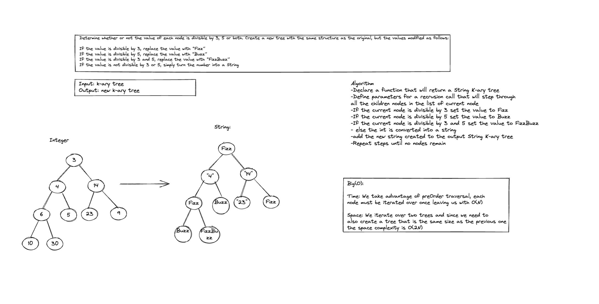

# K-ary Tree

## Big(O):

-Time: We take advantage of preOrder traversal, each
node must be iterated over once leaving us with O(N)

-Space: We iterate over two trees and since we need to 
also create a tree that is the same size as the previous one
the space complexity is O(2N)

- The code for the method can be found in the KaryTree class
