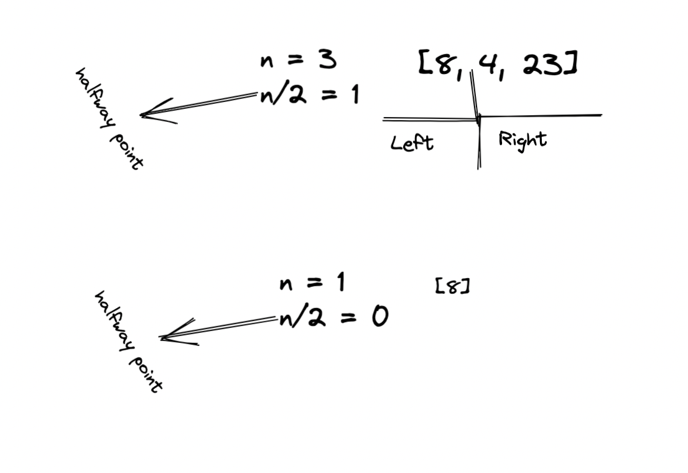
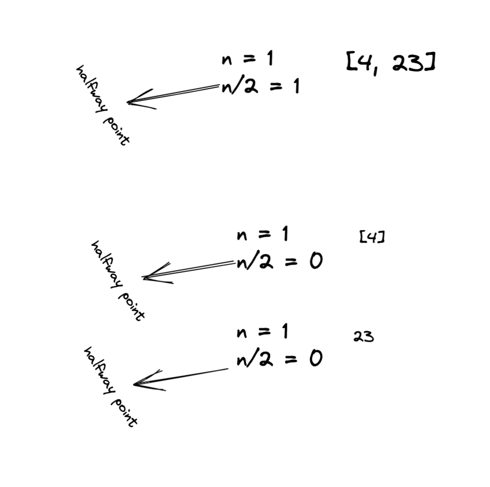
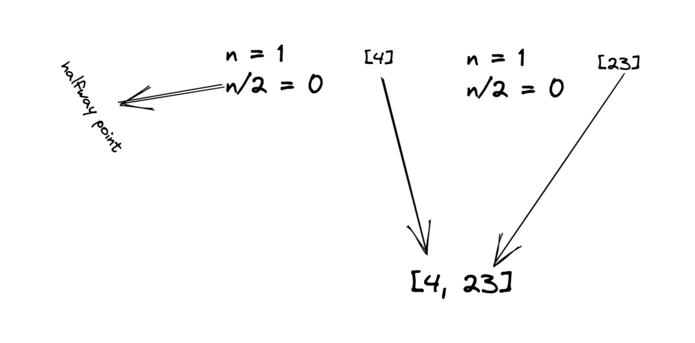
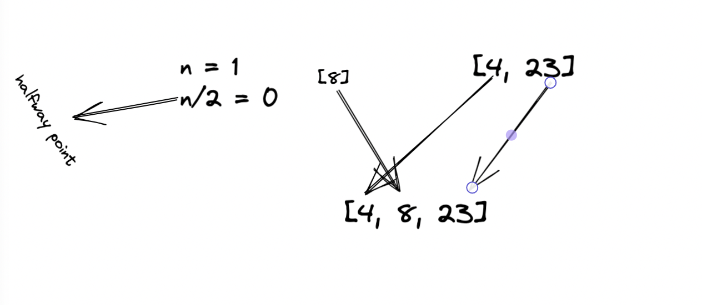
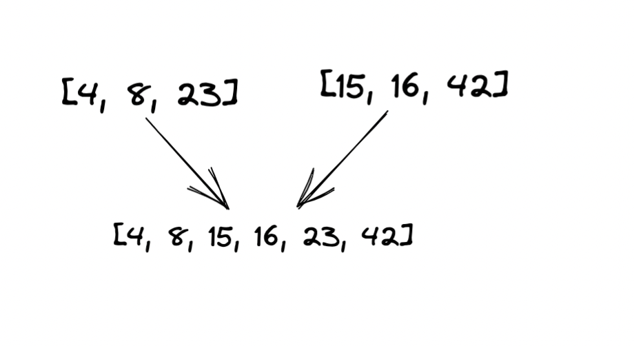

# Merge Sort

- The Merge Sort algorithm is a sorting algorithm that is based on the Divide and Conquer paradigm. In this algorithm, the array is initially divided into two equal halves and then they are combined in a sorted manner.

## Diagram and Step Through
- - array to sort [8, 4, 23, 42, 16, 15]
1. 1. Initial call to mergeSort()
   The first call splits the original array into left and right and calls mergeSort() again on the left side [8, 4, 23]
    
2. Left [8, 4, 23] call to mergeSort()
   The left recursive call splits the left [8, 4, 23] into a left and right and calls mergeSort() again on the sub-left side [8] and returns because [8] has a length of 1. Back to the first left call of mergeSort() we continue.

3. First Right Calls to mergeSort()
   Next we finally use a right sub-array [4, 23]. This is split into a left [4] and a right [23] and then mergeSort is called on the left [4] which returns, and then is called on the right [23] which returns. Back to the first left call to mergeSort() we continue to the first merge() call

4. First call to merge()
   Finally we can perform our first merge() call. At this step the sub-array is already sorted [4, 23] so the same values are overwritten and there is no change. Back to the first left call to mergeSort() we continue.

5. Second call to merge()
   In the last line of the first left call to mergeSort() we call to merge() with [8] and [4, 23] and the sub-array looking like [8, 4, 23]. After performing the sort our sub-array is sorted [4, 8, 23]. Back to the original call to mergeSort() we continue.

6. Repeat steps for the other side
7. Finishing up
   Back again in the original call we invoke merge() with the two sorted sub-arrays [4, 8, 23] and [15, 16, 42]. After merge() processes them we are left with a fully sorted array [4, 8, 15, 16, 23, 42].

## Efficiency

- Time: O(N log N):
  In each recursive call the elements that need to be visited reduce by half. The number of levels required to reduce N to a single element is the number of recursive calls needed. This number is logarithmic or log N. Since the number of recursive calls is log N and the elements to be visited on each call is proportional to N this makes the Big O complexity for time O(N log N).
- Space: O(N):
  The space requirements of the sub arrays add up to N in each recursive call. Since we know there are log N number of recursive calls then the space required is O(N) + O(log N) which reduces to O(N).

## Code can be found in mergeSort class within the sorting package
